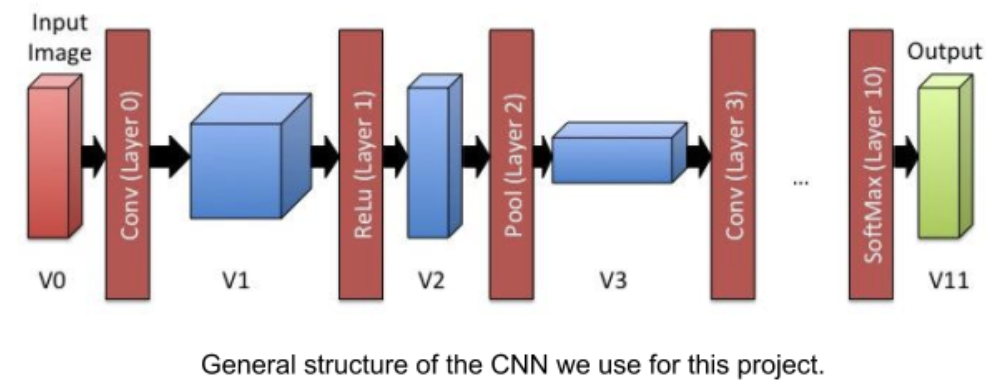

[:leftwards_arrow_with_hook:](README.md#table-of-contents)  
## Κατανόηση του Κώδικα 

### Δομή φακέλου 

Ο φάκελος περιλαμβάνει τα παρακάτω αρχεία: 
```
Makefile 
layers.h 
snapshot/ 
layers_baseline.c 
test/ 
benchmark.c 
network.c 
volume.c 
network.h 
volume.h 
huge_test.sh 
network_baseline.c 
layers.c 
run_test.sh 
```

Τα μόνα αρχεία που επεμβαίνουμε είναι: 

- `layers.c `
- `network.c `
- `volume.c `

Τα αρχεία `layers_baseline.c`, `network_baseline.c`, και `volume_baseline.c` περιλαμβάνουν την σειριακή έκδοση του κώδικα σαν σημείο αναφοράς για μέτρηση της επιτάχυνσης. 

### Επισκόπηση Κώδικα 

Στον κώδικα χρησιμοποιούνται διάφοροι τύποι δεδομένων. Με τον όρο τύποι δεδομένων, εννοούμε τις δομές που με την `typedef` έχουν μετονομαστεί ώστε να έχουν νόημα. Επίσης στα header files υπάρχουν περιγραφές για το τι κάνει κάθε συνάρτηση. 

Πρώτος τύπος δεδομένων `volume_t`, περιλαμβάνει έναν τρισδιάστατο πίνακα (ή όγκο) μεταβλητών double. Χρησιμοποιείται για την αναπαράσταση των αποτελεσμάτων κάθε επιπέδου, καθώς και για τα βάρη κάποιων επιπέδων. 

Στη συνέχεια, έχουμε τα διαφορετικά είδη επιπέδων: `conv`, `relu`, `pool`, `fc`, και `softmax`. Για το καθένα από αυτά υπάρχει: 

- Μία δομή δεδομένων που περιέχει την περιγραφή των παραμέτρων του επιπέδου. Κάθε επίπεδο έχει συγκεκριμένο αριθμό παραμέτρων που δεν αλλάζει κατά την διάρκεια της εκτέλεσης του προγράμματος. Για παράδειγμα, το μέγεθος των όγκων της εισόδου και εξόδου ενός επιπέδου δηλώνεται στον ορισμό του CNN. 
- Μία συνάρτηση `*_forward` οποία εκτελεί την κύρια λειτουργία του επιπέδου. Αυτές οι συναρτήσεις αυτές παίρνουν τη δομή δεδομένων του επιπέδου, και έναν πίνακα pointers των όγκων των εισόδων και των εξόδων. Επιπλέον οι μεταβλητές `start` και `end` δείκτες σε αυτό τον πίνακα. Αυτό επιτρέπει σε κάθε επίπεδο να επεξεργάζεται μια ομάδα εισόδων. Για παράδειγμα, μπορεί να ορίσουμε `start = 5` και `end = 9` για την επεξεργασία των εισόδων `5,6,7,8,9` ταυτόχρονα. Τα αποτελέσματα επιστρέφονται στους αντίστοιχους πίνακες εξόδων. 
- Δύο συναρτήσεις, την `make_*` και `*_load`. Η πρώτη παράγει ένα επίπεδο και με συγκεκριμένο σύνολο παραμέτρων, και η δεύτερη φορτώνει τα βάρη του επιπέδου από αρχείο **.txt*. 

Τελευταία σημαντική δομή δεδομένων είναι η `network_t`, η οποία περιέχει όλες τις πληροφορίες που περιγράφουν το CNN. Αυτό περιλαμβάνει όλα τα επίπεδα, και μία παράμετρο που αφορά στους διάφορους ενδιάμεσους όγκους(volumes). Οι όγκοι (volumes) δεν χρησιμοποιούνται για την αποθήκευση δεδομένων, αυτό γίνεται με τα batches. Χρησιμοποιούνται για να υπάρχουν διαθέσιμες οι διαστάσεις του κάθε όγκου. 

Όλα τα ενδιάμεσα δεδομένα αναπαρίστανται ως batches. Περιλαμβάνουν τα ενδιάμεσα δεδομένα που σχετίζονται με ένα σύνολο εικόνων εισόδου. Το `batch_t` είναι συντομογραφία του `volume_t***`, πρόκειται δηλαδή για δισδιάστατους πίνακες δεικτών σε volumes. Η πρώτη διάσταση δηλώνει το επιπέδου που ανήκει το volume (π.χ., V0, V1, κλπ. στο σχήμα) και η δεύτερη διάσταση δηλώνει την είσοδο. Στο αρχικό πρόγραμμα τα batches έχουν μέγεθος 1 (π.χ., επεξεργαζόμαστε ένα παράδειγμα κάθε φορά), για παραλληλοποίηση θα χρειαστούν μεγαλύτερα batches, τα οποία κάνουμε *allocate* στη μνήμη με την συνάρτηση `make_batch` και απελευθερώνουμε από τη μνήμη με την `free_batch`. 

Τέλος, η συνάρτηση `net_forward` δέχεται ένα batch (καθώς και δείκτες `start/end`) και εφαρμόζει το CNN για κάθε είσοδο από την αρχή μέχρι το τέλος καλώντας τις συναρτήσεις forward για κάθε επίπεδο. Αυτή η συνάρτηση χρησιμοποιείται από την `net_classify`. Παίρνει ένα σύνολο εικόνων, βάζει κάθε μία από αυτές στο volume V0 ενός στοιχείου του batch, και στη συνέχεια τρέχει το δίκτυο σε αυτά. Αποθηκεύουμε τα `likelihoods` (δηλαδή τις τιμές στο τελευταίο επίπεδο του δικτύου) σε έναν 2D πίνακα τύπου `double` ώστε να δούμε που θα ταξινομούσε το δίκτυο την εικόνα. 



---

## Μεταφορά Παραμέτρων Νευρωνικού Δικτύου στην GPU 

Tο `volume`, χρησιμοποιείται για την αναπαράσταση ενεργοποιήσεων (δηλαδή των καταστάσεων) μεταξύ των διαφορετικών επιπέδων του CNN. Έχει τρεις διαστάσεις. Η ερμηνεία τους εξαρτάται από το επίπεδο που τα παρήγαγε. Στο πρώτο επίπεδο, το volume περιέχει τα δεδομένα των εικόνων που θέλουμε να ταξινομήσουμε (όπου βάθος - depth είναι τα τρία χρωματικά κανάλια) . Στο τελευταίο επίπεδο το volume περιέχει τις πιθανότητες μία εικόνα να ανήκει σε μία κατηγορία. Tα βάρη - weights αναπαρίστανται σαν array μίας διάστασης με μέγεθος [πλάτος*ύψος*βάθος]. 

 
```c
typedef struct volume { 
    int width; 
    int height; 
    int depth; 
    double *weights; 
} volume_t; 
```

Η αρχιτεκτονική του νευρωνικού δικτύου ορίζεται ως εξής. 

 
```c
#define NUM_LAYERS 11 

#define NUM_CLASSES 10 
typedef struct network { 
    volume_t *layers[NUM_LAYERS + 1]; 

    conv_layer_t *l0; 
    relu_layer_t *l1; 
    pool_layer_t *l2; 
    conv_layer_t *l3; 
    relu_layer_t *l4; 
    pool_layer_t *l5; 
    conv_layer_t *l6; 
    relu_layer_t *l7; 
    pool_layer_t *l8; 
    fc_layer_t *l9; 
    softmax_layer_t *l10; 
} network_t; 
```

Αποτελείται από 11 επίπεδα (`NUM_LAYERS 11`) , στο `volume_t *layers[]` είναι αποθηκευμένα οι είσοδοι/ έξοδοι κάθε επιπέδου. Το `layers[0]` είναι η εικόνα εσόδου στο νευρωνικό δίκτυο, μεγέθους 32x32x3 και στο `net->layers[0]->weights` βρίσκονται αποθηκευμένα τα pixel της εικόνας. 
Τα `layers[1]`-`layers[11]` περιλαμβάνουν τις εξόδους του κάθε επιπέδου αντίστοιχα. 
Οι μεταβλητές `l0` - `l10` περιλαμβάνουν τις παραμέτρους του κάθε επιπέδου ανάλογα με τη λειτουργεία του καθενός. 

- `l0`,`l3` και `l6` συνελικτικά επίπεδα, `conv_layer_t` 
- `l1`,`l4` και `l7` επίπεδα ReLU, `relu_layer_t` 
- `l2`,`l5` και `l8` επίπεδα Pooling, `pool_layer_t` 
- `l9` πλήρως διασυνδεμένο επίπεδο, `fc_layer_t` 
- `l10` επίπεδο Softmax, `softmax_layer_t` 

Η συνάρτηση `make_network()` δεσμεύει χώρο μνήμης για το νευρωνικό δίκτυο και αρχικοποιεί βασικές παραμέτρους. 

Για να γίνει η μεταφορά των δεδομένων στην κάρτα γραφικών - device, χρειάζεται να κάνουμε *allocate* τη δομή `net` στο device. 

 
```c
network_t *make_network() {  
    network_t *net = (network_t *) malloc(sizeof(network_t));  
#pragma acc enter data create (net[0:1]) 
    net->layers[0] = make_volume(32, 32, 3, 0.0);  
    net->l0 = make_conv_layer(32, 32, 3, 5, 16, 1, 2);  
//Code...  
}  
``` 

Η *directive* `enter data create` χρησιμοποιείται για τον ορισμό μιας μεταβλητής στη συσκευή και μπορεί να χρησιμοποιηθεί αμέσως μετά την εκχώρηση μιας δυναμικής μεταβλητής μέσω `new`, `malloc` ή `allocate` για να ταιριάζει με τη δημιουργία της μεταβλητής του *host*. Παρομοίως, η *directive* `exit data delete` τοποθετείται λίγο πριν τις εντολές `freed`, `deleted` ή `deallocated` στον *host*.[robFab] 

Για κάθε μεταβλητή μέλος του **net**, η απαραίτητη δέσμευση μνήμης στο *device* γίνεται μέσω των αντίστοιχων συναρτήσεων `make_*()`. 

Στη συνάρτηση `make_volume()` τοποθετούμε `enter data create` μετά το `malloc` για το `new_vol` και ξεχωριστά για την μεταβλητή weights καθώς πρόκειται για δυναμική μεταβλητή. Τέλος, με την `update device(new_vol[0:1],new_vol->weights[0:(width * height * depth)])` αντιγράφουμε στη συσκευή τα δεδομένα του `new_vol`. 

 
```c
volume_t *make_volume(int width, int height, int depth, double value) { 
    volume_t *new_vol = malloc(sizeof(struct volume)); 
#pragma acc enter data create(new_vol[0:1]) 
    new_vol->weights = malloc(sizeof(double) * width * height * depth); 
#pragma acc enter data create(new_vol->weights[0:(width * height * depth)]) 
    new_vol->width = width; 
    new_vol->height = height; 
    new_vol->depth = depth; 
 
    for (int x = 0; x < width; x++) { 
        for (int y = 0; y < height; y++) { 
            for (int d = 0; d < depth; d++) { 
                volume_set(new_vol, x, y, d, value); 
            } 
        } 
    } 
#pragma acc update device(new_vol[0:1],new_vol->weights[0:(width * height * depth)]) 
    return new_vol; 
} 
```

Για την αποδέσμευση της μνήμης, στη συνάρτηση `free_volume()` προσθέτουμε `exit data delete(v->weights,v)` 

```c
void free_volume(volume_t *v) { 
    free(v->weights); 
    free(v); 
#pragma acc exit data delete(v->weights,v) 
} 
``` 

Για κάθε συνάρτηση `make_*()`, τοποθετούμε αντίστοιχα *directive* μετά από κάθε `malloc` και αντιγράφουμε τα δεδομένα στο τέλος της συνάρτησης. Όπου έχουμε κλήση της `make_volume()` δεν χρειάζεται κάποιο επιπλέων *directive*. 

###### Convolutional (layers.c:21-54)
```c
conv_layer_t *make_conv_layer(int input_width, int input_height, int input_depth, int filter_width, int num_filters,
        int stride, int pad) {
    conv_layer_t *l = (conv_layer_t *) malloc(sizeof(conv_layer_t));
#pragma acc enter data create(l[0:1])
    l->output_depth = num_filters;

//other parameters....
#pragma acc update device(l[0:1])

    l->filters = malloc(sizeof(volume_t *) * num_filters);
#pragma acc enter data create(l->filters[0:num_filters])
    for (int i = 0; i < num_filters; i++) {
        l->filters[i] = make_volume(l->filter_width, l->filter_height,
            l->input_depth, 0.0);
    }

    l->bias = 0.0;
#pragma acc update device(l->bias)
    l->biases = make_volume(1, 1, l->output_depth, l->bias);

    return l;
}
```
###### ReLu (layers.c:167-179)
```c
relu_layer_t *make_relu_layer(int input_width, int input_height, int input_depth) {
    relu_layer_t *l = (relu_layer_t *) malloc(sizeof(relu_layer_t));
#pragma acc enter data create(l[0:1])
    l->input_depth = input_depth;
    l->input_width = input_width;
    l->input_height = input_height;

    l->output_width = l->input_width;
    l->output_height = l->input_height;
    l->output_depth = l->input_depth;
#pragma acc update device(l[0:1])
    return l;
}
```
###### Pool (layers.c:196-213)
```c
pool_layer_t *make_pool_layer(int input_width, int input_height, int input_depth, int pool_width, int stride) {
    pool_layer_t *l = (pool_layer_t *) malloc(sizeof(pool_layer_t));
#pragma acc enter data create(l[0:1])
    l->pool_width = pool_width;
    //other parameters...
#pragma acc update device(l[0:1])
    return l;
}
```
###### Fully Connected (layers.c:261-284)
```c
fc_layer_t *make_fc_layer(int input_width, int input_height, int input_depth, int num_neurons) {
    fc_layer_t *l = (fc_layer_t *) malloc(sizeof(fc_layer_t));
#pragma acc enter data create(l[0:1])
    l->output_depth = num_neurons;
    //other parameters...
#pragma acc update device(l[0:1])
    l->filters = (volume_t **) malloc(sizeof(volume_t *) * num_neurons);
#pragma acc enter data create(l->filters[0:num_neurons])
    for (int i = 0; i < l->output_depth; i++) {
        l->filters[i] = make_volume(1, 1, l->num_inputs, 0.0);
    }

    l->bias = 0.0;
#pragma acc update device(l->bias)
    l->biases = make_volume(1, 1, l->output_depth, l->bias);

    return l;
}
```
###### Softmax (layers.c:331-347)
```c
softmax_layer_t *make_softmax_layer(int input_width, int input_height, int input_depth) {
    softmax_layer_t *l = (softmax_layer_t*) malloc(sizeof(softmax_layer_t));
#pragma acc enter data create(l[0:1])
    l->input_depth = input_depth;
    // other parameters...
#pragma acc update device(l[0:1])
    l->likelihoods = (double*) malloc(sizeof(double) * l->output_depth);
#pragma acc enter data create(l->likelihoods[0:l->output_depth])

    return l;
}
```

Στην συνάρτηση `free_network()` προσθέτουμε *directives* `exit data delete` πριν από κάθε `free`. 
```c
void free_network(network_t *net) {
    for (int i = 0; i < NUM_LAYERS + 1; i++){
        free_volume(net->layers[i]);}

    // Free each conv layer's filters and biases
    for (int f = 0; f < net->l0->output_depth; f++) {
        free_volume(net->l0->filters[f]);
    }
#pragma acc exit data delete(net->l0->filters)
    free(net->l0->filters);
    free_volume(net->l0->biases);

    for (int f = 0; f < net->l3->output_depth; f++) {
        free_volume(net->l3->filters[f]);
    }
#pragma acc exit data delete(net->l3->filters)
    free(net->l3->filters);
    free_volume(net->l3->biases);

    for (int f = 0; f < net->l6->output_depth; f++) {
        free_volume(net->l6->filters[f]);
    }
#pragma acc exit data delete(net->l6->filters)
    free(net->l6->filters);
    free_volume(net->l6->biases);

    // Free FC layer filters and biases
    for (int f = 0; f < net->l9->output_depth; f++) {
        free_volume(net->l9->filters[f]);
    }
#pragma acc exit data delete(net->l9->filters)
    free(net->l9->filters);
    free_volume(net->l9->biases);

    // Free softmax layer likelihoods
#pragma acc exit data delete(net->l10->likelihoods)
    free(net->l10->likelihoods);

#pragma acc exit data delete(net->l0,net->l1,net->l2,net->l3,net->l4,net->l5,net->l6,net->l7,net->l8,net->l9,net->l10)
    free(net->l0);
    //free l1-l10...
#pragma acc exit data delete(net)
    free(net);
}
```
Επιπλέον, στις συναρτήσεις `copy_volume`, `conv_load` και `fc_load` έχουν προστεθεί τα απαραίτητα *directives* για ενημέρωση των παραμέτρων.

###### conv_load (layers.c:128-165)
```c
void conv_load(conv_layer_t *l, const char *file_name) {
    int filter_width, filter_height, depth, filters;

    FILE *fin = fopen(file_name, "r");
    //Code...
//Update Weights and Biases on Device
    int we=filter_width*filter_height*depth;
    for(int f = 0; f < filters; f++) {
#pragma acc update device(l->filters[f]->weights[0:we])
    }

#pragma acc update device(l->biases->weights[0:l->output_depth])

    fclose(fin);
}
```

###### fc_load (layers.c:305-329)
```c
void fc_load(fc_layer_t *l, const char *filename) {
    FILE *fin = fopen(filename, "r");
   //...Code...

    //Update Weights and Biases on Device
    for(int f = 0; f < l->output_depth; f++) {
#pragma acc update device(l->filters[f]->weights[0:l->num_inputs])
    }
#pragma acc update device(l->biases->weights[0:l->output_depth])
    fclose(fin);
}
```

#### Εκτέλεση Κώδικα

###### Χωρίς -acc 
```
RUNNING BENCHMARK ON 1200 PICTURES... 
Making network... 
16 972 microseconds
```

###### Με -acc 
```
RUNNING BENCHMARK ON 1200 PICTURES... 
Making network... 
167 979 microseconds 
```

[:arrow_heading_up:](01.Makefile.md)
[:arrow_heading_down:](Other/openacc-c-struct.md)

