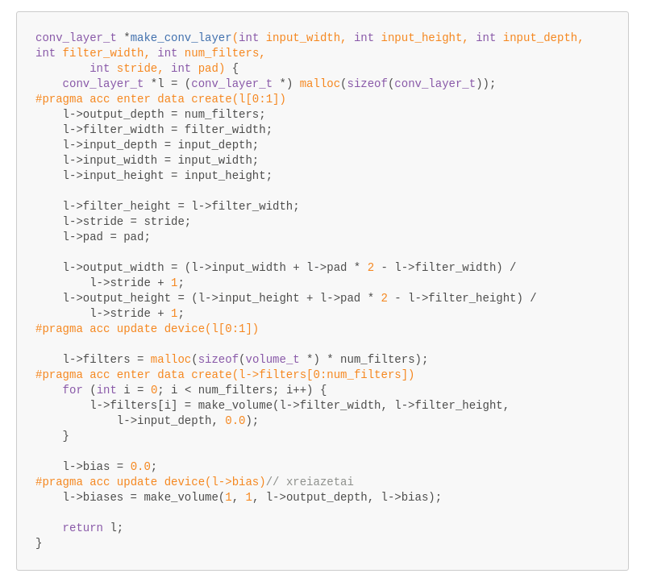
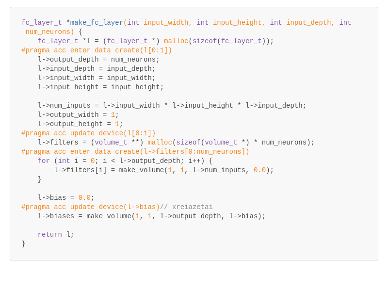
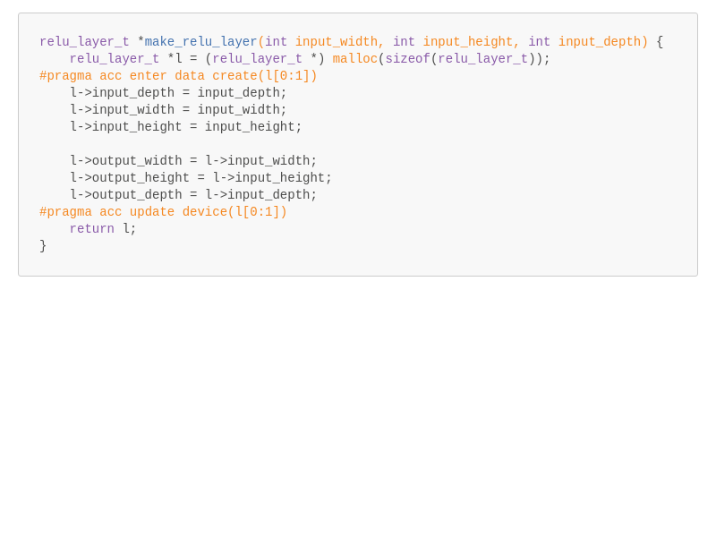
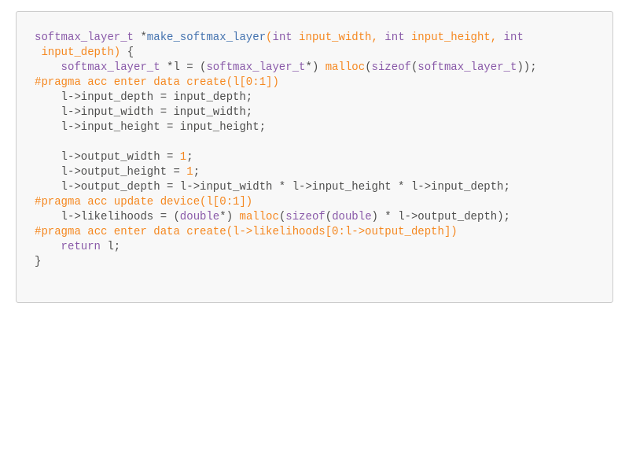

### Δομές δεδομένων νευρωνικού δικτύου

Tο `Volume`, χρησιμοποιείται για την αναπαράσταση ενεργοποιήσεων (δηλαδή των καταστάσεων) μεταξύ των διαφορετικών επιπέδων του CNN. Έχει τρεις διαστάσεις. Η ερμηνεία τους εξαρτάται από το επίπεδο που τα παρήγαγε. Στο πρώτο επίπεδο, το Volume περιέχει τα δεδομένα των εικόνων που θέλουμε να ταξινομήσουμε (όπου βάθος - depth είναι τα τρία χρωματικά κανάλια) . Στο τελευταίο επίπεδο το `Volume` περιέχει τις πιθανότητες μία εικόνα να ανήκει σε μία κατηγορία.

τα βάρη - weights αναπαρίστανται σαν `array` μίας διάστασης με μέγεθος [πλάτος\*ύψος\*βάθος].

```c
typedef struct volume {
    int width;
    int height;
    int depth;
    double *weights;
} volume_t;

```
Η αρχιτεκτονική του νευρωνικού δικτύου ορίζεται ως εξής.

```c
#define NUM_LAYERS 11
#define NUM_CLASSES 10

typedef struct network {
    volume_t *layers[NUM_LAYERS + 1];
    conv_layer_t *l0;
    relu_layer_t *l1;
    pool_layer_t *l2;
    conv_layer_t *l3;
    relu_layer_t *l4;
    pool_layer_t *l5;
    conv_layer_t *l6;
    relu_layer_t *l7;
    pool_layer_t *l8;
    fc_layer_t *l9;
    softmax_layer_t *l10;
} network_t;
```

Αποτελείται από 11 επίπεδα (`NUM_LAYERS 11`) , στο `volume_t *layers[]` είναι αποθηκευμένα οι είσοδοι/ έξοδοι κάθε επιπέδου.  Το `layers[0]` είναι η εικόνα εσόδου στο νευρωνικό δίκτυο, μεγέθους 32x32x3 (`net->layers[0]->width* net->layers[0]->height* net->layers[0]->depth`) και στο `net->layers[0]->weights` βρίσκονται αποθηκευμένα τα pixel της εικόνας.  
Τα `layers[1]-layers[11]` περιλαμβάνουν τις εξόδους του κάθε επιπέδου αντίστοιχα. 
Οι μεταβλητές `l0 - l10` περιλαμβάνουν τις παραμέτρους του κάθε επιπέδου ανάλογα με τη λειτουργεία του καθενός.  
* `l0`,`l3` και `l6` συνελικτικά επίπεδα, `conv_layer_t` 
* `l1`,`l4` και `l7` επίπεδα ReLU, `relu_layer_t`  
* `l2`,`l5` και `l8` επίπεδα Pooling, `pool_layer_t`
* `l9` πλήρως διασυνδεμένο επίπεδο, `fc_layer_t` 
* `l10` επίπεδο Softmax, `softmax_layer_t` 

Η συνάρτηση `make_network()` δεσμεύει χώρο μνήμης για το νευρωνικό δίκτυο και αρχικοποιεί βασικές παραμέτρους. 

Για να γίνει η μεταφορά των δεδομένων στην κάρτα γραφικών - *device*, χρειάζεται να κάνουμε *allocate* τη δομή `net` στο *device*.

```c++
network_t *make_network() { 
    network_t *net = (network_t *) malloc(sizeof(network_t)); 
#pragma acc enter data create (net[0:1])
    net->layers[0] = make_volume(32, 32, 3, 0.0); 
    net->l0 = make_conv_layer(32, 32, 3, 5, 16, 1, 2); 
//Code... 
} 
```
---
Η *directive* `enter data create` χρησιμοποιείται για τον ορισμό μιας μεταβλητής στη συσκευή και μπορεί να χρησιμοποιηθεί αμέσως μετά την εκχώρηση μιας δυναμικής μεταβλητής μέσω `new`, `malloc` ή `allocate` για να ταιριάζει με τη δημιουργία της μεταβλητής του host. Παρομοίως, η *directive* `exit data delete` τοποθετείται λίγο πριν τις εντολές `freed`, `deleted` ή `deallocated` στον host.[^robfarber]

Για κάθε μεταβλητή μέλος του `net`, η απαραίτητη δέσμευση μνήμης στο *device* γίνεται μέσω των αντίστοιχων συναρτήσεων `make_*()`.

Στη συνάρτηση `make_volume()` τοποθετούμε `enter data create` μετά το `malloc` για το `new_vol` και ξεχωριστά για την μεταβλητή `weights` καθώς πρόκειται για δυναμική μεταβλητή. Τέλος, με την `update device(new_vol[0:1],new_vol->weights[0:(width * height * depth)])` αντιγράφουμε στη συσκευή τα δεδομένα του `new_vol`.

```c++
volume_t *make_volume(int width, int height, int depth, double value) {
    volume_t *new_vol = malloc(sizeof(struct volume));
#pragma acc enter data create(new_vol[0:1])
    new_vol->weights = malloc(sizeof(double) * width * height * depth);
#pragma acc enter data create(new_vol->weights[0:(width * height * depth)])
    new_vol->width = width;
    new_vol->height = height;
    new_vol->depth = depth;

    for (int x = 0; x < width; x++) {
        for (int y = 0; y < height; y++) {
            for (int d = 0; d < depth; d++) {
                volume_set(new_vol, x, y, d, value);
            }
        }
    }
#pragma acc update device(new_vol[0:1],new_vol->weights[0:(width * height * depth)])
    return new_vol;
}
```
Για την αποδέσμευση της μνήμης, στη συνάρητη `free_volume()` προσθέτουμε `exit data delete(v->weights,v)`

```c++
void free_volume(volume_t *v) {
    free(v->weights);
    free(v);
#pragma acc exit data delete(v->weights,v)
}
```

Για κάθε συνάρτηση `make_*()`, τοποθετούμε αντίστοιχα  *directive* μετά από κάθε `malloc` και αντιγράφουμε τα δεδομένα στο τέλος της συνάρτησης. Όπου έχουμε κλήση της `make_volume()` δεν χρειάζεται κάποιο επιπλέων `directive`.
|   |   |
|---|---|
|   |   |
|   |   |

Στην συνάρτηση `free_network()` προσθέτουμε *directives* `exit data delete` πριν από κάθε `free`.

```c
void free_network(network_t *net) {
    for (int i = 0; i < NUM_LAYERS + 1; i++){
        free_volume(net->layers[i]);}

    // Free each conv layer's filters and biases
    for (int f = 0; f < net->l0->output_depth; f++) {
        free_volume(net->l0->filters[f]);
    }
#pragma acc exit data delete(net->l0->filters)
    free(net->l0->filters);
    free_volume(net->l0->biases);

    for (int f = 0; f < net->l3->output_depth; f++) {
        free_volume(net->l3->filters[f]);
    }
#pragma acc exit data delete(net->l3->filters)
    free(net->l3->filters);
    free_volume(net->l3->biases);

    for (int f = 0; f < net->l6->output_depth; f++) {
        free_volume(net->l6->filters[f]);
    }
#pragma acc exit data delete(net->l6->filters)
    free(net->l6->filters);
    free_volume(net->l6->biases);

    // Free FC layer filters and biases
    for (int f = 0; f < net->l9->output_depth; f++) {
        free_volume(net->l9->filters[f]);
    }
#pragma acc exit data delete(net->l9->filters)
    free(net->l9->filters);
    free_volume(net->l9->biases);

    // Free softmax layer likelihoods
#pragma acc exit data delete(net->l10->likelihoods)
    free(net->l10->likelihoods);

#pragma acc exit data delete(net->l0,net->l1,net->l2,net->l3,net->l4,net->l5,net->l6,net->l7,net->l8,net->l9,net->l10)
    free(net->l0);
    free(net->l1);
    free(net->l2);
    free(net->l3);
    free(net->l4);
    free(net->l5);
    free(net->l6);
    free(net->l7);
    free(net->l8);
    free(net->l9);
    free(net->l10);
#pragma acc exit data delete(net)
    free(net);
}
```


Αποτελέσματα `-Minfo=all` από nvc compiler:

```
nvc -Wall -tp=native -c99 -mp -Minfo=all -acc -g  -c benchmark.c
nvc -Wall -tp=native -c99 -mp -Minfo=all -acc -g  -c network.c
make_network:
     23, Generating enter data create(net[:1])
free_network:
     69, Generating exit data delete(net->l0->filters[:1][:1])
     76, Generating exit data delete(net->l3->filters[:1][:1])
     83, Generating exit data delete(net->l6->filters[:1][:1])
     91, Generating exit data delete(net->l9->filters[:1][:1])
     96, Generating exit data delete(net->l10->likelihoods[:1])
     99, Generating exit data delete(net->l0[:1],net->l8[:1],net->l7[:1],net->l6[:1],net->l5[:1],net->l4[:1],net->l3[:1],net->l2[:1],net->l1[:1],net->l10[:1],net->l9[:1])
    111, Generating exit data delete(net[:1])
nvc -Wall -tp=native -c99 -mp -Minfo=all -acc -g  -c layers.c
make_conv_layer:
     25, Generating enter data create(l[:1])
     41, Generating update device(l[:1])
         Generating enter data create(l->filters[:num_filters])
     50, Generating update device(l->bias)
conv_forward:
    113, FMA (fused multiply-add) instruction(s) generated
conv_load:
    159, Generating update device(l->filters->->weights[:we])
    163, Generating update device(l->biases->weights[:l->output_depth])
make_relu_layer:
    169, Generating enter data create(l[:1])
    177, Generating update device(l[:1])
make_pool_layer:
    198, Generating enter data create(l[:1])
    211, Generating update device(l[:1])
make_fc_layer:
    263, Generating enter data create(l[:1])
    272, Generating update device(l[:1])
         Generating enter data create(l->filters[:num_neurons])
    280, Generating update device(l->bias)
fc_forward:
    296, FMA (fused multiply-add) instruction(s) generated
fc_load:
    325, Generating update device(l->filters->->weights[:l->num_inputs])
    327, Generating update device(l->biases->weights[:l->output_depth])
make_softmax_layer:
    333, Generating enter data create(l[:1])
    341, Generating update device(l[:1])
    343, Generating enter data create(l->likelihoods[:l->output_depth])
nvc -Wall -tp=native -c99 -mp -Minfo=all -acc -g  -c volume.c
make_volume:
     30, Generating enter data create(new_vol[:1])
     32, Generating enter data create(new_vol->weights[:depth*(height*width)])
     44, Generating update device(new_vol[:1],new_vol->weights[:depth*(height*width)])
free_volume:
     67, Generating exit data delete(v[:1],v->weights[:1])
nvc -Wall -tp=native -c99 -mp -Minfo=all -acc -g  -o benchmark benchmark.o network.o layers.o volume.o -lm

```
#### Συναρτήσεις *_load()

Με τις συναρτήσεις `conv_load` και `fc_load` διαβάζουμε από τις παραμέτρους του προεκαπιδευμένουν νευρωνικού δικτύο από τα αντίστοιχα *.txt* αρχεία. Ενημερώνουμε τα δεδομένα τις συσκευής με προσθήκη `update device` στο τέλος των συναρτήσεων.
```c
void conv_load(conv_layer_t *l, const char *file_name) {
    int filter_width, filter_height, depth, filters;

    FILE *fin = fopen(file_name, "r");
// Code...

 int we=filter_width*filter_height*depth;
    for(int f = 0; f < filters; f++) {
#pragma acc update device(l->filters[f]->weights[0:we])
    }

#pragma acc update device(l->biases->weights[0:l->output_depth])

    fclose(fin);
}
```

```c
void fc_load(fc_layer_t *l, const char *filename) {
    FILE *fin = fopen(filename, "r");
//Code...
   for(int f = 0; f < l->output_depth; f++) {
#pragma acc update device(l->filters[f]->weights[0:l->num_inputs])
    }
#pragma acc update device(l->biases->weights[0:l->output_depth])
    fclose(fin);
}
```

---
##### Αποτέλεσμα:

```
make compare
```
```
./benchmark benchmark
RUNNING BENCHMARK ON 1200 PICTURES...
Making network...
115812 microseconds
./benchmark_baseline benchmark
RUNNING BENCHMARK ON 1200 PICTURES...
Making network...
12587 microseconds
```
##### Αποτελέσματα Profiler: 

```
$ nvprof ./benchmark benchmark
RUNNING BENCHMARK ON 1200 PICTURES...
Making network...
==84878== NVPROF is profiling process 84878, command: ./benchmark benchmark
311819 microseconds
==84878== Profiling application: ./benchmark benchmark
==84878== Profiling result:
            Type  Time(%)      Time     Calls       Avg       Min       Max  Name
 GPU activities:   99.05%  977.52us       415  2.3550us  1.0560us  85.792us  [CUDA memcpy HtoD]
                    0.95%  9.3770us         4  2.3440us  2.3040us  2.3680us  [CUDA memset]
[...]
```

[^robfarber]: Mathew Colgrove. Chapter 5 - advanced data management. Στο Parallel Programming with OpenACC Rob Farber, επιμελητής, σελίδες 83–110. Morgan Kaufmann, Boston,
2017
